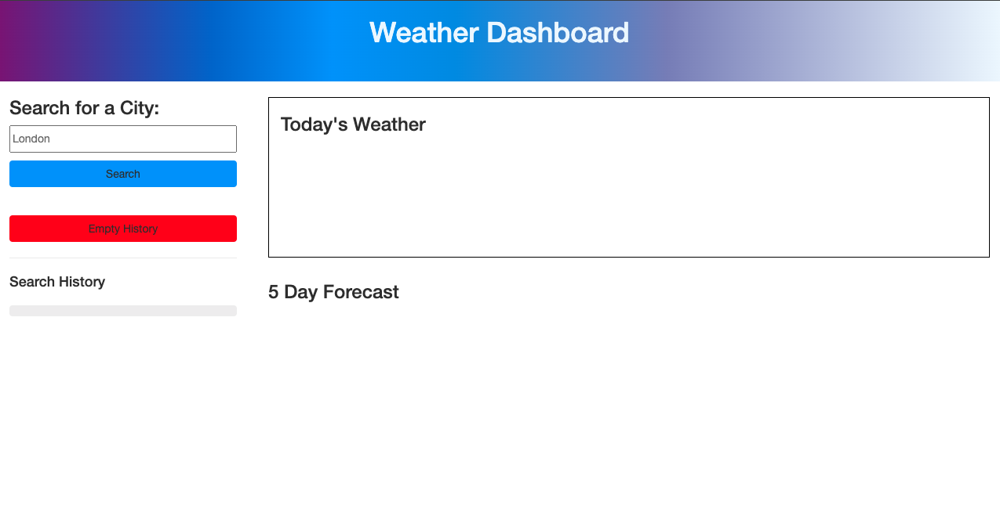
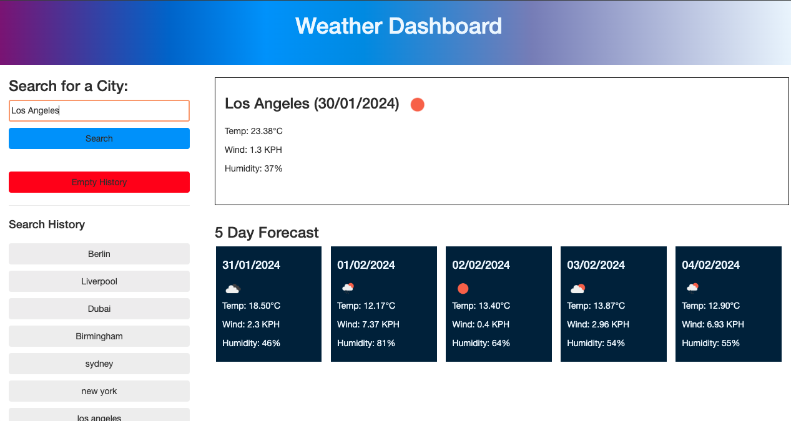

# Weather Dashboard

## Description

This application is designed to be used as a personal weather forecast, where the user can view the 5 day forecast for any City. They can also revisit old searches; in doing so, this acts as a dashboard where someone can store their favourite locations and swiftly view the forecast.

**The functionality is achieved through the following means:**

* Three **OpenWeatherMap APIs** are used to retrieve various pieces of information. These are:
  * Geolocation API: This API receives a city as an input and returns the longitude and latitude of this city.
  * 5-Day Weather API: This API receives the long and lat from the Geolocation API and returns a 5 day forecast for this place.
  * Current Weather API: This API receives the long and lat from the Geolocation API and returns the weather of a given city at the present time.
* A combination of HTML, Bootstrap and standard CSS is used to create the framework of the page.
* Additional content is created dynamically using for-loops and jQuery.
* Click events used to store the user input and create buttons in the history section.
* Local storage used to ensure that the results are retrievable.

## Installation 

To review the quiz, please follow this URL: https://github.com/MichaelFriel/weather-dashboard. The code is available to be cloned from the **weather-dashboard repository**, using git commands. To access this, please follow this URL: https://michaelfriel.github.io/weather-dashboard/

## Usage Guide

The usage for this application is very simple and is as follows:
* When the application loads, the user can see a Search Bar and some empty content areas.
* Add a City in the search bar, which will load the current weather plus the five day forecast.
* If the exact City is not within the database, it will move to an area within the city.
  * e.g. if the user searches Barcelona, the name shown is Sant Pere, Santa Caterina i La Ribera, which is a town in Barcelona.
* Once the user has searched, a button containing the city text will be displayed within the Search History section.
* These buttons can be used to revisit old searches and the list can be deleted by clicking Empty History.

*This image shows the application upon page load*

*This image shows the current weather in Los Angeles and a Five-Day Forecast*

## Credits
This application relies on the OpenWeatherMap API: https://openweathermap.org/api